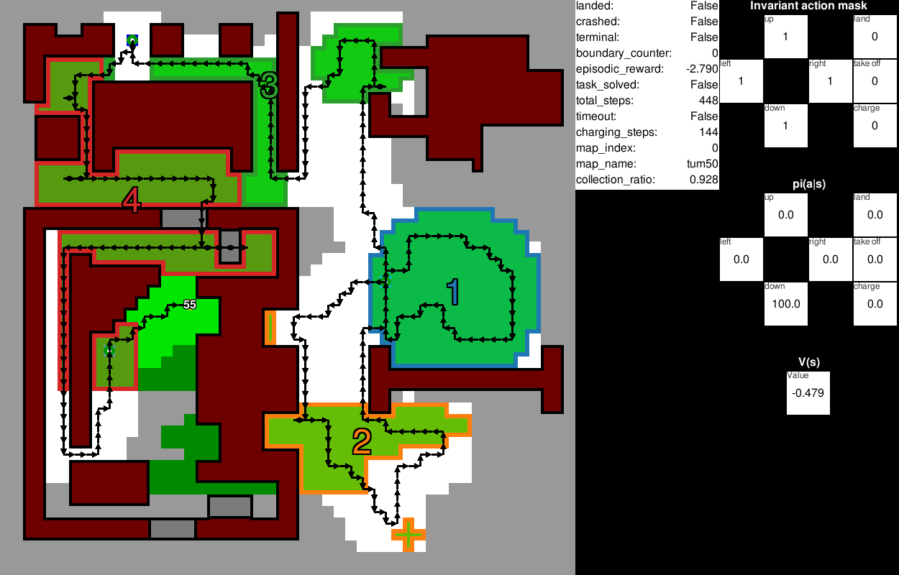

## Old Versions

The previous repository to recreate the [ICAR](https://ieeexplore.ieee.org/abstract/document/9659413) results is found
in the icar branch. For the [Learning to Recharge](https://arxiv.org/abs/2309.03157) results, the old repository is
found in the learning_to_recharge branch.

## Table of contents

* [Introduction](#introduction)
* [Requirements](#requirements)
* [How to use](#how-to-use)
* [Resources](#resources)
* [Reference](#reference)
* [License](#license)

## Introduction

This repository contains the implementation of
the [Equivariant Ensembles and Regularization for Reinforcement Learning in Map-based Path Planning](https://arxiv.org/abs/2403.12856)
based on the [power-constrained coverage path planning (CPP) with recharge problem](https://arxiv.org/abs/2309.03157).
This repository contains the implementation of the Equivariant Ensembles and Regularization implementation for the CPP
problem. An animation of the Ensemble agent is shown in the following gif.


Additionally, it utilizes map-based observations,
preprocessed as global and local maps, action masking to ensure safety, discount factor scheduling to optimize the
long-horizon problem, and position history observations to avoid state loops. The agents are stored in a submodule and can be pulled by

```commandline
git submodule init
git submodule update --remote
```

For questions, please contact Mirco Theile via email mirco.theile@tum.de.

## Requirements

```
tensorflow~=2.11.1
opencv-python==4.7.0.68
scikit-image==0.21.0
gymnasium==0.27.0
pygame==2.5.1
tqdm~=4.64.1
seaborn==0.12.2
dataclasses-json==0.5.7
einops~=0.6.1
```

Developed and tested only on Linux and MacOS.

## How to use

With this repository PPO agents can be trained to solve the power-constrained CPP problem with recharge. The agents can
make use of equivariant ensembles and regularization. Additionally, newly trained and example agents can be evaluated
with a visualization.

### Training

#### General usage:

```
python train.py [-h] [--gpu] [--gpu_id GPU_ID] [--id ID] [--generate] [--verbose] [--params [PARAMS ...]] config

positional arguments:
  config                Path to config file

options:
  -h, --help            show this help message and exit
  --gpu                 Activates usage of GPU
  --gpu_id GPU_ID       Activates usage of GPU on specific GPU id
  --id ID               Gives the log files a specific name, else config name
  --generate            Generate config file for parameter class
  --verbose             Prints the network summary at the start
  --params [PARAMS ...]
                        Override parameters as: path/to/param1 value1 path/to/param2 value2 ...

```

#### How to recreate all the agents used in the paper:

- Baseline ```python train.py --gpu config/baseline.json```
- Ensemble ```python train.py --gpu config/ens.json```
- Regularization ```python train.py --gpu config/reg.json```
- Ensemble + Regularization ```python train.py --gpu config/ens_reg.json```
- Augmentation ```python train.py --gpu config/rot_aug.json```

### Evaluating



#### General Usage

```
python evaluate.py [-h] [-a [A ...]] [-d] [-r [R ...]] [-n N] [--scenario SCENARIO] [--scenarios SCENARIOS] [--all_maps] [--heuristic] [--stochastic] [--maps_only] [--gym_only]
                   [--gpu] [--gpu_id GPU_ID] [--id ID] [--generate] [--verbose] [--params [PARAMS ...]]
                   config

positional arguments:
  config                Path to config file

options:
  -h, --help            show this help message and exit
  -a [A ...]            Add maps
  -d                    remove all other maps
  -r [R ...]            Record episode only, potentially override render params
  -n N                  Parallel gyms for evaluate
  --scenario SCENARIO   Load specific scenario
  --scenarios SCENARIOS
                        Load file with multiple scenarios
  --all_maps            Load all maps
  --heuristic           Use Heuristic Only
  --stochastic          Set agent to stochastic
  --maps_only           Draws maps only
  --gym_only            Only evaluates gym. Specify full config path.
  --gpu                 Activates usage of GPU
  --gpu_id GPU_ID       Activates usage of GPU on specific GPU id
  --id ID               Gives the log files a specific name, else config name
  --generate            Generate config file for parameter class
  --verbose             Prints the network summary at the start
  --params [PARAMS ...]
                        Override parameters as: path/to/param1 value1 path/to/param2 value2 ...

```

For instructions in the interactive evaluation environment press the ```h``` key.

#### Recreate scenarios in the paper:

To run the agents from the paper, make sure the submodule is initialized. Run the following commands to run the
respective agents:

Baseline:
```python evaluate.py baseline```

Ensemble:
```python evaluate.py ens```

Regularization:
```python evaluate.py reg```

Ensemble + Regularization:
```python evaluate.py ens_reg```

Augmentation:
```python evaluate.py rot_aug```

Add ```--all_maps``` to evaluate on all maps including the OOD maps.

## Resources

The maps from the paper are included in the 'res' directory. Map information is
formatted as PNG files with one pixel representing one grid-world cell. The pixel color determines the type of cell
according to

* red #ff0000 no-fly zone (NFZ)
* blue #0000ff start and landing zone
* yellow #ffff00 buildings blocking field-of-view (FoV)

If you would like to create a new map, you can use any tool to draw a PNG with the same pixel dimensions as the
desired map and the above color codes.

When maps are loaded for the first time, a model is computed that is later used by the FoV calculation, action mask, and
heuristic. The model is saved as 'res/[map_name]_model.pickle'. For large maps, this process may take a few minutes.

## Reference

If using this code for research purposes, please cite:

For the Equivariant Ensembles and Regularization for Reinforcement Learning in Map-based Path Planning:

```
@misc{theile2024equivariant,
  title={Equivariant Ensembles and Regularization for Reinforcement Learning in Map-based Path Planning},
  author={Theile, Mirco and Cao, Hongpeng and Caccamo, Marco and Sangiovanni-Vincentelli, Alberto L},
  journal={arXiv preprint arXiv:2403.12856},
  year={2024}
}
```

For the power-constrained CPP problem with recharge:

```
@article{theile2023learning,
  title={Learning to recharge: UAV coverage path planning through deep reinforcement learning},
  author={Theile, Mirco and Bayerlein, Harald and Caccamo, Marco and Sangiovanni-Vincentelli, Alberto L},
  journal={arXiv preprint arXiv:2309.03157},
  year={2023}
}
```

## License

This code is under a BSD license.
